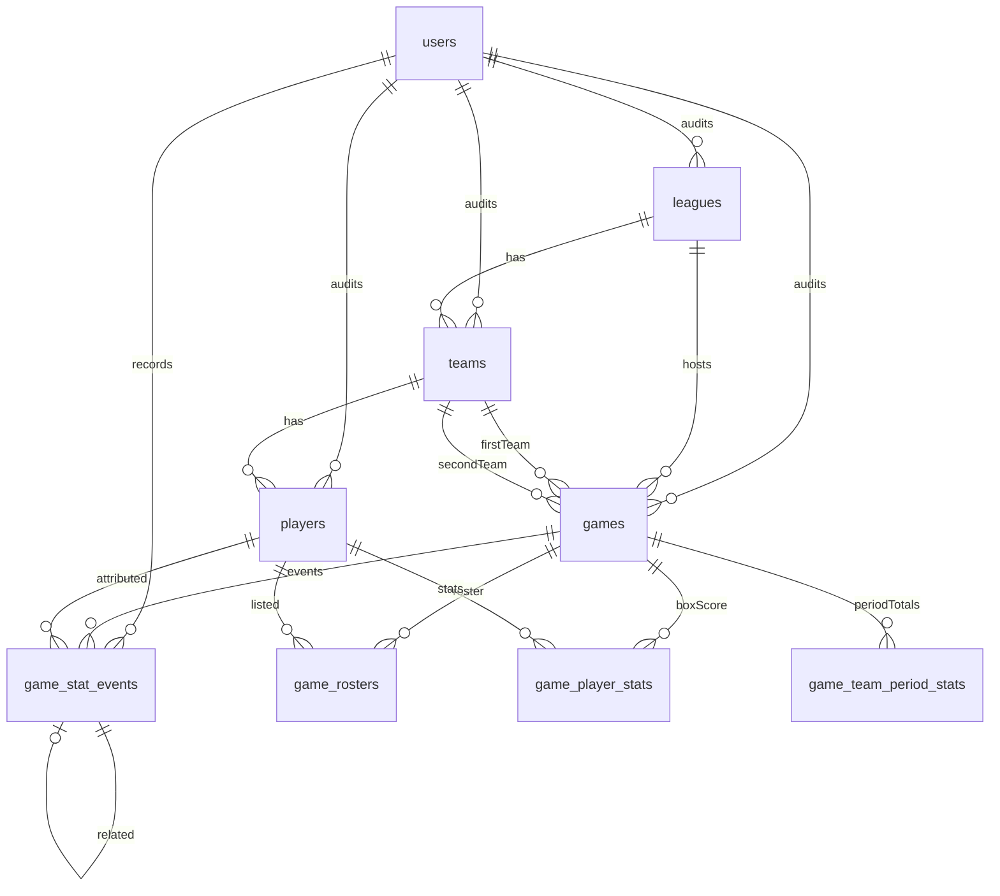
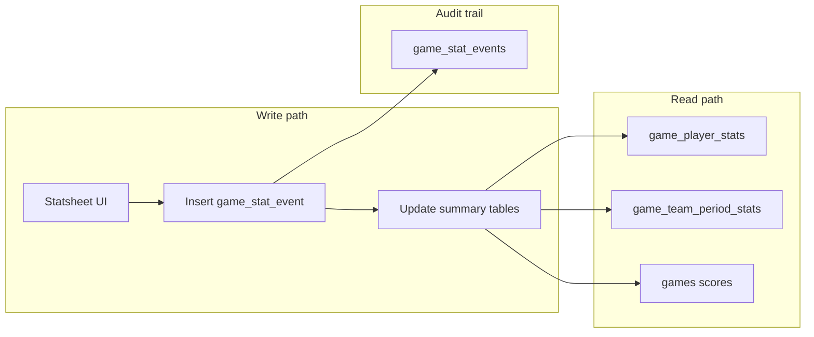

# Database schema

This document describes the Ballerz PostgreSQL schema: how leagues, teams, games, and live statsheet data fit together, and how stat changes are recorded.

## Overview

The schema has two layers:

1. **Organization** — leagues, teams, players, and users. These are long-lived records with standard audit columns (who created/updated/deleted a row).
2. **Live statsheet** — games, rosters, stat events, and materialized totals. Stats are recorded as an append-only event log; summary tables are updated in the same transaction for fast reads.



## Shared conventions

### IDs and timestamps

Most tables use:

- `id` — serial primary key (`idColumn` in `src/schema/columns.ts`)
- `created_at`, `updated_at` — timezone-aware timestamps

### Audit columns

Entity tables (leagues, teams, players, games, game rosters) include `auditColumns`:

| Column                                   | Purpose               |
| ---------------------------------------- | --------------------- |
| `created_by`, `updated_by`, `deleted_by` | FK → `users.id`       |
| `deleted_at`                             | Soft delete timestamp |

Relations for `creator`, `updater`, and `deleter` are added via `createAuditRelations()` in `src/schema/audit.ts`.

`users` is the root entity and only has timestamps — no self-referential audit FKs.

### Schema exports

Each domain lives in its own file under `src/schema/`. `src/schema/index.ts` is **auto-generated** by `scripts/sync-schema-index.ts` when you run `db:generate` or `check-types`. Add a new schema file there; do not edit the index manually.

---

## Organization tables

### `users`

App accounts used to record who entered stats and who audited entity changes.

| Column     | Notes                            |
| ---------- | -------------------------------- |
| `email`    | Unique, required                 |
| `name`     | Optional display name            |
| `password` | Required (hash at the app layer) |

### `leagues`

Top-level competition container.

| Column | Notes                |
| ------ | -------------------- |
| `name` | Optional league name |

### `teams`

| Column      | Notes                              |
| ----------- | ---------------------------------- |
| `league_id` | FK → `leagues.id` (cascade delete) |
| `name`      | Optional team name                 |

### `players`

Roster members belonging to a team.

| Column                    | Notes                            |
| ------------------------- | -------------------------------- |
| `team_id`                 | FK → `teams.id` (cascade delete) |
| `first_name`, `last_name` | Required                         |
| `number`                  | Jersey number                    |
| `position`                | Optional                         |
| `is_captain`              | Default `false`                  |

---

## Game tables

### `games`

A single matchup between two teams in a league.

| Column                                  | Type / default                                | Purpose                                |
| --------------------------------------- | --------------------------------------------- | -------------------------------------- |
| `league_id`                             | FK                                            | Parent league                          |
| `first_team_id`, `second_team_id`       | FK → `teams`                                  | The two sides                          |
| `type`                                  | `regular`, `playoffs`, `exhibition`, `finals` | Default `regular`                      |
| `status`                                | See below                                     | Default `scheduled`                    |
| `current_period`                        | See below                                     | Nullable until tip-off                 |
| `first_team_score`, `second_team_score` | Integer                                       | Default `0`; updated on scoring events |
| `started_at`, `ended_at`                | Timestamp                                     | Optional lifecycle markers             |

**`game_status`:** `scheduled` → `in_progress` → `halftime` → `final`, or `cancelled`.

**`game_period`:** `q1`–`q4`, `ot1`–`ot5`.

Games can be created before tip-off with scores at `0` and `status = scheduled`.

### `game_rosters`

Links players to a specific game. Team membership alone is not enough — a player must appear on the game roster to be part of that statsheet.

| Column                 | Notes                                     |
| ---------------------- | ----------------------------------------- |
| `game_id`, `player_id` | Unique together                           |
| `team_id`              | Which side the player is on for this game |
| `is_dnp`               | Did not play; default `false`             |
| `is_starter`           | Optional; useful for display order        |

When a player is marked DNP, set `is_dnp = true` on the roster row **and** record a `dnp_marked` stat event so the change appears in the chronological log.

---

## Statsheet architecture

Live stats use a **hybrid event-sourced** design:



| Table                    | Role                                                           |
| ------------------------ | -------------------------------------------------------------- |
| `game_stat_events`       | **Source of truth** — every stat change, ordered by `sequence` |
| `game_player_stats`      | Materialized box score per player (fast grid reads)            |
| `game_team_period_stats` | Timeouts and team fouls per quarter                            |
| `games`                  | Denormalized team scores for the scoreboard                    |

Summary tables are updated in the **same database transaction** as each event insert. Do not update them directly from the UI — always go through the event service.

---

## `game_stat_events`

Append-only log of every stat action. Rows are never deleted or soft-deleted.

| Column              | Notes                                                  |
| ------------------- | ------------------------------------------------------ |
| `game_id`           | FK → `games.id`                                        |
| `sequence`          | Per-game order: `1`, `2`, `3`, … Unique with `game_id` |
| `occurred_at`       | When the play happened (defaults to now)               |
| `period`            | Quarter/OT when the event occurred                     |
| `event_type`        | See event types below                                  |
| `player_id`         | Nullable for team-only events (`timeout`)              |
| `team_id`           | Required on all events                                 |
| `reverses_event_id` | Self-FK; set on correction events                      |
| `related_event_id`  | Self-FK; e.g. assist linked to a score event           |
| `recorded_by`       | FK → `users.id` (who entered the stat)                 |
| `created_at`        | Insert time (immutable)                                |

### Event types

| `event_type`        | Player stats         | Team period   | Score |
| ------------------- | -------------------- | ------------- | ----- |
| `fg2_made`          | +1 FG2M/A, +2 pts    | —             | +2    |
| `fg2_missed`        | +1 FG2A              | —             | —     |
| `fg3_made`          | +1 FG3M/A, +3 pts    | —             | +3    |
| `fg3_missed`        | +1 FG3A              | —             | —     |
| `ft_made`           | +1 FTM/A, +1 pt      | —             | +1    |
| `ft_missed`         | +1 FTA               | —             | —     |
| `assist`            | +1 ast               | —             | —     |
| `turnover`          | +1 to                | —             | —     |
| `offensive_rebound` | +1 oreb              | —             | —     |
| `defensive_rebound` | +1 dreb              | —             | —     |
| `personal_foul`     | +1 pf                | +1 team fouls | —     |
| `technical_foul`    | +1 tf                | —             | —     |
| `timeout`           | —                    | +1 timeouts   | —     |
| `dnp_marked`        | Sets roster `is_dnp` | —             | —     |

Technical fouls do **not** increment team foul count. Only `personal_foul` does.

### Reversals (undo)

Mistakes are corrected with **reversal events**, not deletes:

1. Insert a new row with the same `event_type`, `player_id`, `team_id`, and `period` as the original.
2. Set `reverses_event_id` to the original event’s `id`.
3. Apply the **inverse** deltas to aggregates and scores.

Rules enforced by `reverseStatEvent()`:

- The target event must exist and must not itself be a reversal.
- Each event can only be reversed once.

For **totals**, an event is active when no other event has `reverses_event_id` pointing at it. The timeline still shows both the original and the reversal in sequence order.

---

## `game_player_stats`

One row per `(game_id, player_id)` — the live box score line for that player.

| Column                                     | Box score label               |
| ------------------------------------------ | ----------------------------- |
| `fg2_made`, `fg2_attempted`                | 2PT FGM / FGA                 |
| `fg3_made`, `fg3_attempted`                | 3PT FGM / FGA                 |
| `ft_made`, `ft_attempted`                  | FTM / FTA                     |
| `assists`                                  | AST                           |
| `turnovers`                                | TO                            |
| `offensive_rebounds`, `defensive_rebounds` | OREB / DREB                   |
| `personal_fouls`, `technical_fouls`        | PF / TF                       |
| `points`                                   | PTS (`2×FG2M + 3×FG3M + FTM`) |

Rows are created or incremented by `recordStatEvent()` / `reverseStatEvent()`. DNP players can have a row of zeros so the statsheet grid stays aligned with the roster.

---

## `game_team_period_stats`

One row per `(game_id, team_id, period)`.

| Column          | Updated by                  |
| --------------- | --------------------------- |
| `timeouts_used` | `timeout` events            |
| `team_fouls`    | `personal_foul` events only |

Use this table for per-quarter timeout and team foul columns on the statsheet without scanning the full event log on every refresh.

---

## Recording stats (application layer)

Use the exported service functions from `@repo/db` — do not insert into summary tables directly.

### Record an event

```ts
import { db, recordStatEvent } from "@repo/db";

await recordStatEvent(db, {
  gameId: 1,
  period: "q1",
  eventType: "fg2_made",
  teamId: 5,
  playerId: 12,
  recordedBy: userId,
});
```

Optional fields: `relatedEventId` (e.g. link an assist to a score), `occurredAt`.

### Reverse an event

```ts
import { reverseStatEvent } from "@repo/db";

await reverseStatEvent(db, {
  eventId: 42,
  recordedBy: userId,
});
```

### Inspect delta mapping

`getStatEventEffects(eventType, { isFirstTeam, multiplier })` in `src/services/stat-event-deltas.ts` returns the player, team-period, score, and DNP effects for an event type. `multiplier` is `1` for normal events and `-1` for reversals.

---

## Typical game workflow

1. Create a **game** with `status = scheduled`, teams, and league.
2. Populate **game rosters** for both teams (`is_starter`, initial `is_dnp = false`).
3. At tip-off, set `status = in_progress`, `current_period = q1`, `started_at`.
4. On each stat tap, call **`recordStatEvent()`** with the current period.
5. To mark DNP, call **`recordStatEvent()`** with `event_type = dnp_marked` (updates roster + log).
6. Advance `current_period` and `status` (e.g. `halftime`) on the `games` row as the app state machine requires.
7. At the final buzzer, set `status = final` and `ended_at`.

Period changes on the `games` row are separate from stat events — events carry their own `period` column for when the play occurred.

---

## Indexes

| Table                    | Index                               | Purpose                      |
| ------------------------ | ----------------------------------- | ---------------------------- |
| `game_stat_events`       | `(game_id, sequence)` unique        | Timeline ordering            |
| `game_stat_events`       | `(game_id, period)`                 | Quarter-filtered views       |
| `game_stat_events`       | `(reverses_event_id)`               | Reversal lookups             |
| `game_player_stats`      | `(game_id, player_id)` unique       | One line per player          |
| `game_player_stats`      | `(game_id)`                         | Load full box score          |
| `game_team_period_stats` | `(game_id, team_id, period)` unique | One row per team per quarter |
| `game_rosters`           | `(game_id, player_id)` unique       | One roster slot per player   |

---

## Schema file map

| File                        | Contents                                             |
| --------------------------- | ---------------------------------------------------- |
| `columns.ts`                | `idColumn`, `timestamps`, soft delete                |
| `audit.ts`                  | `auditColumns`, `createAuditRelations`               |
| `types.ts`                  | `InferQueryModel` and related helpers                |
| `users.ts`                  | `users`                                              |
| `leagues.ts`                | `leagues`                                            |
| `teams.ts`                  | `teams`                                              |
| `players.ts`                | `players`                                            |
| `game-enums.ts`             | `game_status`, `game_period`, `game_stat_event_type` |
| `games.ts`                  | `games`, `game_types`                                |
| `game-rosters.ts`           | `game_rosters`                                       |
| `game-stat-events.ts`       | `game_stat_events`                                   |
| `game-player-stats.ts`      | `game_player_stats`                                  |
| `game-team-period-stats.ts` | `game_team_period_stats`                             |

Service layer:

| File                            | Contents                              |
| ------------------------------- | ------------------------------------- |
| `services/stat-event-deltas.ts` | Event type → delta mapping            |
| `services/record-stat-event.ts` | `recordStatEvent`, `reverseStatEvent` |

---

## Migrations

SQL migrations live in `packages/db/drizzle/`. The statsheet schema was introduced in `0002_game_statsheet.sql`.

After changing schema files:

```sh
bun run db:generate   # from repo root
bun run db:migrate
```

---

## Phase 2 (not in schema yet)

These were intentionally deferred but fit the event model when needed:

- Substitutions and minutes played
- Plus/minus
- Game clock on each event
- Rebuild aggregates by replaying events from JSON
